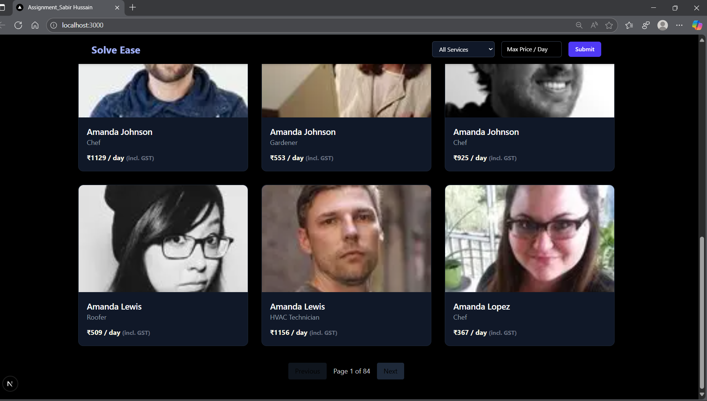

# SolveEase – Assignement-Sabir-Hussain
A full-stack web application built with **Next.js (App Router)**, **TypeScript**, and **Tailwind CSS**, providing a platform to list and browse service workers with filtering and pagination.  

---

## 🚀 Getting Started  

### ✅ Prerequisites  
- **Node.js v18.x** (tested on `18.17.1`)  
- **npm** or **yarn** installed  

---

### 📦 Installation & Setup  

## Clone the repository and install dependencies:  

git clone https://github.com/yourusername/assignment-Sabir-Hussain.git
cd assignment-Sabir-Hussain
npm install

## Start the development server:  

## npm run dev
The app will be available at: [http://localhost:3000](http://localhost:3000)  

---

## 🏗️ Build for Production  

Using **npm**:  

## npm run dev
## npm start

---

## 📚 Features Implemented  

- Built using **Next.js App Router** with server and client components.  
- Written in **TypeScript** for type safety and better developer experience.  
- Styled with **Tailwind CSS** for a responsive and clean UI.  
- Fetches worker data from a mock API route: `/api/workers`.  
- Filtering options implemented by:  
  - Service type  
  - Maximum price per day  
- Pagination for browsing results (12 workers per page).  
- Optimized images using **next/image**.  
- **Navbar features**:  
  - Dropdown to filter by service  
  - Input to filter by max price  
  - Link to an external Google Form for submissions  

---

## 📁 Directory Structure  

| Path | Description |
|------|-------------|
| `src/app/page.tsx` | Main workers listing page (App Router) |
| `src/Components/Navbar.tsx` | Navbar component with filtering controls |
| `src/pages/api/workers.ts` | API route serving mock worker data |
| `public/workers.json` (optional) | Source of static worker data (mock) |

---

## ✅ Assumptions  

- The backend API at `/api/workers` is mocked and returns static JSON data.  
- **GST is assumed to be 18%**, calculated and displayed on the frontend only.  
- Worker images are assumed to be either:  
  - Stored in the `public/` directory, or  
  - Loaded from remote URLs (e.g., CDN).  
- Worker service types are consistently named to ensure accurate filtering.  

---

## ⚖️ Trade-offs & Known Issues  

- Uses client-side filtering and pagination, which may not scale with large datasets.  
- API is mocked and not connected to a real backend or database.  
- Filter state is not persisted in the URL, so it resets on page refresh.  
- Error handling is minimal (e.g., plain text for API fetch errors).  
- ESLint warning for unused variable `error` resolved by prefixing with `_error`.  

## 📸 Screenshots

### Home – Listings

### Filters – Service & Price

### Pagination

### Mobile View

